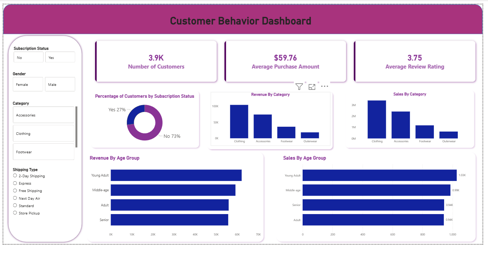

# Customer_behavior_Analysis_Dashboard-using-Python-SQL-Power-BI-and-Gamma.Ai

📊 Customer Behaviour Analysis Dashboard
📌 Project Overview

This project analyses 3,900 customer purchase records to uncover actionable insights into customer behaviour, revenue drivers, and product performance. The goal was to move beyond descriptive charts and build a decision-focused dashboard that answers real business questions around subscriptions, demographics, pricing, and loyalty.

The final output is an interactive Power BI dashboard supported by Python-based data preparation and analysis.

---

🎯 Business Objectives

1.Understand who drives revenue across demographics and categories

2.Evaluate the impact of subscriptions on customer spending

3.Identify high-performing and discount-dependent products

4.Analyse age-group and shipping preferences to guide targeting

5.Translate insights into clear, actionable business recommendations

---
 
🧾 Dataset Summary

Total records: 3,900 purchases

Features: 18 columns

Geographic coverage: 50 locations

Key attributes:

Customer demographics (age, gender, location)

Purchase details (category, amount, discounts, promo usage)

Behavioural metrics (purchase frequency, previous purchases)

Ratings and shipping preferences

Subscription status

---
🛠️ Tools & Technologies

Python – Data cleaning, feature engineering, exploratory analysis

Pandas & NumPy – Data manipulation

PostgreSQL – Structured data storage and SQL analysis

Power BI – Interactive dashboard design and visual storytelling

Gamma AI - For generating industry level presentation

---

🔄 Data Preparation & Feature Engineering

Handled missing review ratings using median imputation by category

Created derived features such as:

age_group (binned age segments)

Purchase frequency indicators

Standardised column naming conventions

Loaded cleaned data into PostgreSQL for structured querying

---

📈 Key Insights

Subscription Gap: Only 27% of customers are subscribers, yet loyal non-subscribers generate significant revenue → strong opportunity for targeted conversion

Demographic Trends: Young adults and male customers contribute the highest revenue

Shipping Behaviour: Express shipping customers spend more on average, indicating willingness to pay for convenience

Discount Dynamics: Discount users are not low-value customers; many still spend above average

Product Performance: Certain products rely heavily on discounts, suggesting pricing strategy review

---
📊 Dashboard Highlights

Customer count, average purchase value, and review ratings KPIs

Revenue & sales breakdown by category and age group

Subscription status distribution and revenue comparison

Interactive filters for gender, category, shipping type, and subscription status

---
💡 Business Recommendations

Increase subscription adoption among loyal repeat buyers

Optimise discount strategy for margin-heavy categories

Focus marketing on high-value demographics and express shipping users

Leverage top-rated products more aggressively in campaigns

---

🚀 What This Project Demonstrates

End-to-end data analytics workflow

Strong focus on business impact, not just visuals

Ability to convert raw data into clear strategic insights

Practical use of Python, SQL, and Power BI together

---

